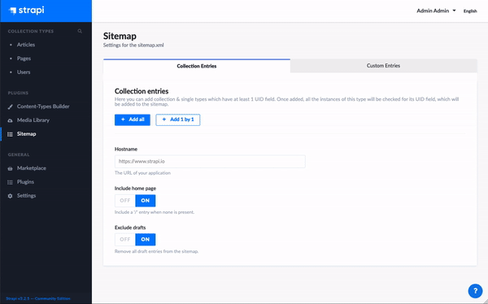

# Strapi Plugin Sitemap

Every public website should have a sitemap.xml to increase SEO. A website where the content is managed by [Strapi](http://strapi.io/) should be no different. With this plugin you can generate a sitemap server side, which allows you to customize it based on your data structure in Strapi. 

This plugin uses the UID field type to fetch URLs, and therefor expects a Strapi version of `3.0.0-beta.19.3` or higher.

## Installation

Use `npm` or `yarn` to install and build the plugin.

	yarn add strapi-plugin-sitemap
	yarn build
	yarn develop

## Configuration

Before you can generate the sitemap you need to specify what you want to be in it. In the admin section of the plugin you can add 'Collection entries' and 'Custom entries' to the sitemap. With collection entries you can add all URLs of a collection or single type, with custom entries you can add URLs which are not managed by Strapi. Also make sure to set the `hostname` of your website. 

After saving the settings and generating the sitemap, it will be written in the `/public` folder of your Strapi project, making it available at `http://localhost:1337/sitemap.xml`. 

## Optional (but recommended)

1. Add the `sitemap.xml` to the `.gitignore` of your project.

2. Make sure the sitemap is always up-to-date. You can either add a cron job, or create a lifecycle method to run the `createSitemap()` service.

## Cron job example

	// Generate the sitemap every 12 hours
	'0 */12 * * *': () => {
	    strapi.plugins.sitemap.services.sitemap.createSitemap();
	},

## Resources

- [MIT License](LICENSE.md)

## Links

- [NPM package](https://www.npmjs.com/package/strapi-plugin-sitemap)
- [GitHub repository](https://github.com/boazpoolman/strapi-plugin-sitemap)

## ⭐️ Show your support

Give a star if this project helped you.
